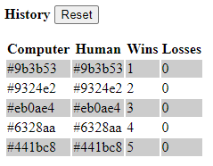

[](https://classroom.github.com/a/SY1VHWvx)
[](https://classroom.github.com/open-in-codespaces?assignment_repo_id=15184359)
### SD555-Workshop-01
Welcome to the first workshop of the SD555 course. We are going to build a HEX color guessing game!  
  
## Game Specifications
In this game users will have to guess the displayed color from 3 buttons as shown below:
<p align="center">
  
</p>
  
## Game Requirements
1. Create a custom directive `CheatDirective` and apply it to the displayed color space, it will allow users to double-click the displayed colored space and see an alert with the computer HEX color code. 
2. Persist the history in the `localStorage` object and restore the history and scoreboard when the app reloads. Add a button to reset the history. History should be displayed as zebra effect.
3. The three Hex buttons should be disabled after 10 wins and enabled again after you reset the history.
  
<p align="center">
  
</p>

## Code Assistance
The two private methods below generate a random HEX color value, and pick a random value from a given array:
```typescript
  #generateRandomHexColor(): string {
    return '#' + (Math.random() * 0xFFFFFF << 0).toString(16).padStart(6, '0');
  }
  
  #getRandomItemFromArray(arr: string[]): string {
    return arr[Math.floor(Math.random() * arr.length)];
  }
```
Good luck to everyone, and happy coding!  
